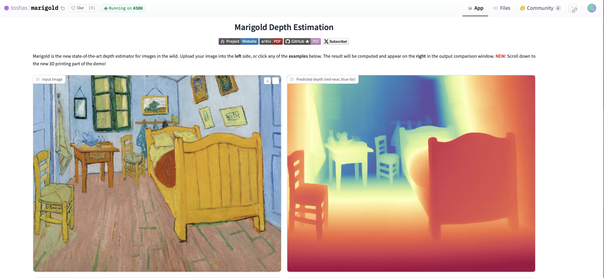
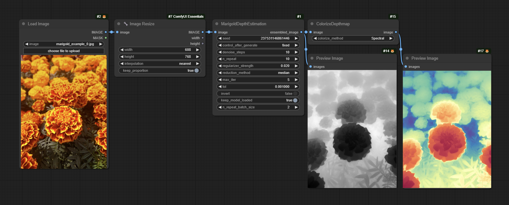
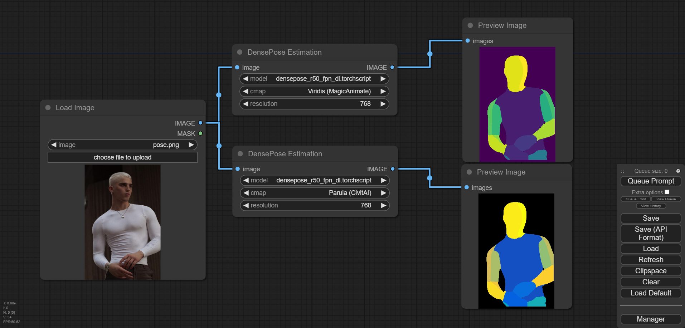
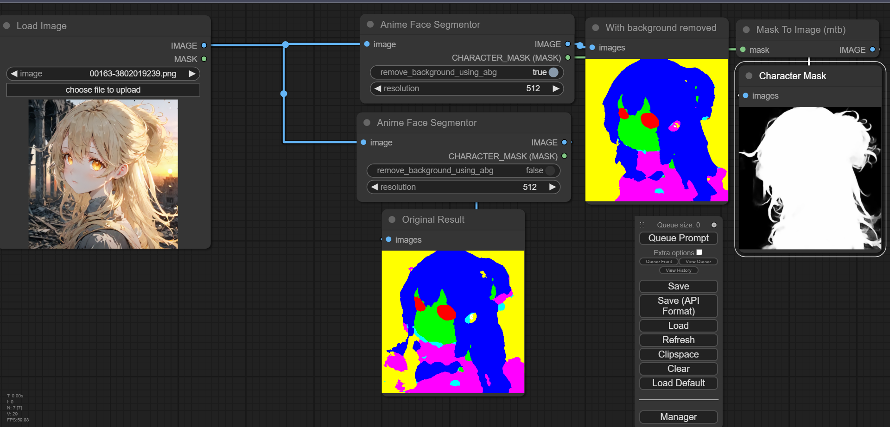
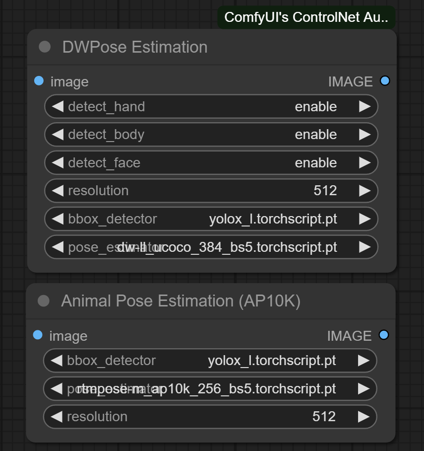

# ComfyUI's ControlNet Auxiliary Preprocessors

Plug-and-play ComfyUI node sets for making [ControlNet](https://github.com/lllyasviel/ControlNet/) hint images

The code is copy-pasted from the respective folders in https://github.com/lllyasviel/ControlNet/tree/main/annotator and connected to [the 🤗 Hub](https://huggingface.co/lllyasviel/Annotators).

All credit & copyright goes to https://github.com/lllyasviel.

# Marigold
Check out Marigold Depth Estimator which can generate very detailed and sharp depth map from high-resolution still images. The mesh created by it is even 3D-printable. Due to diffusers, it can't be implemented in this extension but there is an Comfy implementation by Kijai
https://github.com/kijai/ComfyUI-Marigold




# Updates
Go to [Update page](./UPDATES.md) to follow updates

# Installation:
## Using ComfyUI Manager (recommended):
Install [ComfyUI Manager](https://github.com/ltdrdata/ComfyUI-Manager) and do steps introduced there to install this repo.

## Alternative:
If you're running on Linux, or non-admin account on windows you'll want to ensure `/ComfyUI/custom_nodes` and `comfyui_controlnet_aux` has write permissions.

There is now a **install.bat** you can run to install to portable if detected. Otherwise it will default to system and assume you followed ConfyUI's manual installation steps. 

If you can't run **install.bat** (e.g. you are a Linux user). Open the CMD/Shell and do the following:
  - Navigate to your `/ComfyUI/custom_nodes/` folder
  - Run `git clone https://github.com/Fannovel16/comfyui_controlnet_aux/`
  - Navigate to your `comfyui_controlnet_aux` folder
    - Portable/venv:
       - Run `path/to/ComfUI/python_embeded/python.exe -s -m pip install -r requirements.txt`
	- With system python
	   - Run `pip install -r requirements.txt`
  - Start ComfyUI

# Nodes
Please note that this repo only supports preprocessors making hint images (e.g. stickman, canny edge, etc).
All preprocessors except Inpaint are intergrated into `AIO Aux Preprocessor` node. 
This node allow you to quickly get the preprocessor but a preprocessor's own threshold parameters won't be able to set.
You need to use its node directly to set thresholds.

# Nodes (sections are categories in Comfy menu)
## Line Extractors
| Preprocessor Node           | sd-webui-controlnet/other |          ControlNet/T2I-Adapter           |
|-----------------------------|---------------------------|-------------------------------------------|
| Binary Lines                | binary                    | control_scribble                          |
| Canny Edge                  | canny                     | control_v11p_sd15_canny <br> control_canny <br> t2iadapter_canny |
| HED Lines                   | hed                       | control_v11p_sd15_softedge <br> control_hed |
| Standard Lineart            | standard_lineart          | control_v11p_sd15_lineart                 |
| Realistic Lineart           | lineart (or `lineart_coarse` if `coarse` is enabled) | control_v11p_sd15_lineart |
| Anime Lineart               | lineart_anime             | control_v11p_sd15s2_lineart_anime         |
| Manga Lineart               | lineart_anime_denoise     | control_v11p_sd15s2_lineart_anime         |
| M-LSD Lines                 | mlsd                      | control_v11p_sd15_mlsd <br> control_mlsd  |
| PiDiNet Lines               | pidinet                   | control_v11p_sd15_softedge <br> control_scribble |
| Scribble Lines              | scribble                  | control_v11p_sd15_scribble <br> control_scribble |
| Scribble XDoG Lines         | scribble_xdog             | control_v11p_sd15_scribble <br> control_scribble |
| Fake Scribble Lines         | scribble_hed              | control_v11p_sd15_scribble <br> control_scribble |

## Normal and Depth Estimators
| Preprocessor Node           | sd-webui-controlnet/other |          ControlNet/T2I-Adapter           |
|-----------------------------|---------------------------|-------------------------------------------|
| MiDaS Depth Map           | (normal) depth            | control_v11f1p_sd15_depth <br> control_depth <br> t2iadapter_depth |
| LeReS Depth Map           | depth_leres               | control_v11f1p_sd15_depth <br> control_depth <br> t2iadapter_depth |
| Zoe Depth Map             | depth_zoe                 | control_v11f1p_sd15_depth <br> control_depth <br> t2iadapter_depth |
| MiDaS Normal Map          | normal_map                | control_normal                            |
| BAE Normal Map            | normal_bae                | control_v11p_sd15_normalbae               |
| MeshGraphormer Hand Refiner ([HandRefinder](https://github.com/wenquanlu/HandRefiner))  |               | [control_sd15_inpaint_depth_hand_fp16](https://huggingface.co/hr16/ControlNet-HandRefiner-pruned/blob/main/control_sd15_inpaint_depth_hand_fp16.safetensors) |

## Faces and Poses Estimators
| Preprocessor Node           | sd-webui-controlnet/other |          ControlNet/T2I-Adapter           |
|-----------------------------|---------------------------|-------------------------------------------|
| DWPose Estimator                 | dw_openpose_full          | control_v11p_sd15_openpose <br> control_openpose <br> t2iadapter_openpose |
| OpenPose Estimator               | openpose (detect_body) <br> openpose_hand (detect_body + detect_hand) <br> openpose_faceonly (detect_face) <br> openpose_full (detect_hand + detect_body + detect_face)    | control_v11p_sd15_openpose <br> control_openpose <br> t2iadapter_openpose |
| MediaPipe Face Mesh         | mediapipe_face            | controlnet_sd21_laion_face_v2             | 
| Animal Estimator                 | animal_openpose           | [control_sd15_animal_openpose_fp16](https://huggingface.co/huchenlei/animal_openpose/blob/main/control_sd15_animal_openpose_fp16.pth) |

An array of [OpenPose-format JSON](https://github.com/CMU-Perceptual-Computing-Lab/openpose/blob/master/doc/02_output.md#json-output-format) corresponsding to each frame in an IMAGE batch can be gotten from DWPose and OpenPose using `app.nodeOutputs` on the UI or `/history` API endpoint. JSON output from AnimalPose uses a kinda similar format to OpenPose JSON:
```
[
    {
        "version": "ap10k",
        "animals": [
            [[x1, y1, 1], [x2, y2, 1],..., [x17, y17, 1]],
            [[x1, y1, 1], [x2, y2, 1],..., [x17, y17, 1]],
            ...
        ],
        "canvas_height": 512,
        "canvas_width": 768
    },
    ...
]
```

For extension developers (e.g. Openpose editor):
```js
const poseNodes = app.graph._nodes.filter(node => ["OpenposePreprocessor", "DWPreprocessor", "AnimalPosePreprocessor"].includes(node.type))
for (const poseNode of poseNodes) {
    const openposeResults = JSON.parse(app.nodeOutputs[poseNode.id].openpose_json[0])
    console.log(openposeResults) //An array containing Openpose JSON for each frame
}
```

For API users:
Javascript
```js
import fetch from "node-fetch" //Remember to add "type": "module" to "package.json"
async function main() {
    const promptId = '792c1905-ecfe-41f4-8114-83e6a4a09a9f' //Too lazy to POST /queue
    let history = await fetch(`http://127.0.0.1:8188/history/${promptId}`).then(re => re.json())
    history = history[promptId]
    const nodeOutputs = Object.values(history.outputs).filter(output => output.openpose_json)
    for (const nodeOutput of nodeOutputs) {
        const openposeResults = JSON.parse(nodeOutput.openpose_json[0])
        console.log(openposeResults) //An array containing Openpose JSON for each frame
    }
}
main()
```

Python
```py
import json, urllib.request

server_address = "127.0.0.1:8188"
prompt_id = '' #Too lazy to POST /queue

def get_history(prompt_id):
    with urllib.request.urlopen("http://{}/history/{}".format(server_address, prompt_id)) as response:
        return json.loads(response.read())

history = get_history(prompt_id)[prompt_id]
for o in history['outputs']:
    for node_id in history['outputs']:
        node_output = history['outputs'][node_id]
        if 'openpose_json' in node_output:
            print(json.loads(node_output['openpose_json'][0])) #An list containing Openpose JSON for each frame
```
## Semantic Segmentation
| Preprocessor Node           | sd-webui-controlnet/other |          ControlNet/T2I-Adapter           |
|-----------------------------|---------------------------|-------------------------------------------|
| OneFormer ADE20K Segmentor  | oneformer_ade20k          | control_v11p_sd15_seg                     |
| OneFormer COCO Segmentor    | oneformer_coco            | control_v11p_sd15_seg                     |
| UniFormer Segmentor         | segmentation              |control_sd15_seg <br> control_v11p_sd15_seg|

## T2IAdapter-only
| Preprocessor Node           | sd-webui-controlnet/other |          ControlNet/T2I-Adapter           |
|-----------------------------|---------------------------|-------------------------------------------|
| Color Pallete               | color                     | t2iadapter_color                          |
| Content Shuffle             | shuffle                   | t2iadapter_style                          |

# Examples
> A picture is worth a thousand words

Credit to https://huggingface.co/thibaud/controlnet-sd21 for most examples below. You can get the same kind of results from preprocessor nodes of this repo.
## Line Extractors
### Canny Edge

### HED Lines

### Realistic Lineart

### Scribble/Fake Scribble


## Normal and Depth Map
### Depth (idk the preprocessor they use)

## Zoe - Depth Map

## BAE - Normal Map

## MeshGraphormer

## Faces and Poses
### OpenPose


### Animal Pose (AP-10K)


### DensePose


## Semantic Segmantation
### OneFormer ADE20K Segmentor


### Anime Face Segmentor


## T2IAdapter-only
### Color Pallete for T2I-Adapter


# Testing workflow
https://github.com/Fannovel16/comfyui_controlnet_aux/blob/master/tests/test_cn_aux_full.json


# Q&A:
## Why some nodes doesn't appear after I installed this repo?

This repo has a new mechanism which will skip any custom node can't be imported. If you meet this case, please create a issue on [Issues tab](https://github.com/Fannovel16/comfyui_controlnet_aux/issues) with the log from the command line.

## DWPose/AnimalPose only uses CPU so it's so slow. How can I make it use GPU?
There are two ways to speed-up DWPose: using TorchScript checkpoints (.torchscript.pt) checkpoints or ONNXRuntime (.onnx). TorchScript way is little bit slower than ONNXRuntime but doesn't require any additional library and still way way faster than CPU. 

A torchscript bbox detector is compatiable with an onnx pose estimator and vice versa.
### TorchScript
Set `bbox_detector` and `pose_estimator` according to this picture. You can try other bbox detector endings with `.torchscript.pt` to reduce bbox detection time if input images are ideal.

### ONNXRuntime
If onnxruntime is installed successfully and the checkpoint used endings with `.onnx`, it will replace default cv2 backend to take advantage of GPU. Note that if you are using NVidia card, this method currently can only works on CUDA 11.8 (ComfyUI_windows_portable_nvidia_cu118_or_cpu.7z) unless you compile onnxruntime yourself.

1. Know your onnxruntime build:
* * NVidia/AMD GPU: `onnxruntime-gpu`
* * DirectML: `onnxruntime-directml`
* * OpenVINO: `onnxruntime-openvino`

Note that if this is your first time using ComfyUI, please test if it can run on your device before doing next steps.

2. Add it into `requirements.txt`

3. Run `install.bat` or pip command mentioned in Installation


# 500 Stars 😄
[](https://star-history.com/#Fannovel16/comfyui_controlnet_aux&Date)

Thanks for yalls supports. I never thought the graph for stars would be linear lol.

# Assets files of preprocessors
* anime_face_segment:  [bdsqlsz/qinglong_controlnet-lllite/Annotators/UNet.pth](https://huggingface.co/bdsqlsz/qinglong_controlnet-lllite/blob/main/Annotators/UNet.pth), [anime-seg/isnetis.ckpt](https://huggingface.co/skytnt/anime-seg/blob/main/isnetis.ckpt)
* densepose:  [LayerNorm/DensePose-TorchScript-with-hint-image/densepose_r50_fpn_dl.torchscript](https://huggingface.co/LayerNorm/DensePose-TorchScript-with-hint-image/blob/main/densepose_r50_fpn_dl.torchscript)
* dwpose:  
* * bbox_detector: Either [yzd-v/DWPose/yolox_l.onnx](https://huggingface.co/yzd-v/DWPose/blob/main/yolox_l.onnx), [hr16/yolox-onnx/yolox_l.torchscript.pt](https://huggingface.co/hr16/yolox-onnx/blob/main/yolox_l.torchscript.pt), [hr16/yolo-nas-fp16/yolo_nas_l_fp16.onnx](https://huggingface.co/hr16/yolo-nas-fp16/blob/main/yolo_nas_l_fp16.onnx), [hr16/yolo-nas-fp16/yolo_nas_m_fp16.onnx](https://huggingface.co/hr16/yolo-nas-fp16/blob/main/yolo_nas_m_fp16.onnx), [hr16/yolo-nas-fp16/yolo_nas_s_fp16.onnx](https://huggingface.co/hr16/yolo-nas-fp16/blob/main/yolo_nas_s_fp16.onnx)
* * pose_estimator: Either [hr16/DWPose-TorchScript-BatchSize5/dw-ll_ucoco_384_bs5.torchscript.pt](https://huggingface.co/hr16/DWPose-TorchScript-BatchSize5/blob/main/dw-ll_ucoco_384_bs5.torchscript.pt), [yzd-v/DWPose/dw-ll_ucoco_384.onnx](https://huggingface.co/yzd-v/DWPose/blob/main/dw-ll_ucoco_384.onnx)
* animal_pose (ap10k):
* * bbox_detector: Either [yzd-v/DWPose/yolox_l.onnx](https://huggingface.co/yzd-v/DWPose/blob/main/yolox_l.onnx), [hr16/yolox-onnx/yolox_l.torchscript.pt](https://huggingface.co/hr16/yolox-onnx/blob/main/yolox_l.torchscript.pt), [hr16/yolo-nas-fp16/yolo_nas_l_fp16.onnx](https://huggingface.co/hr16/yolo-nas-fp16/blob/main/yolo_nas_l_fp16.onnx), [hr16/yolo-nas-fp16/yolo_nas_m_fp16.onnx](https://huggingface.co/hr16/yolo-nas-fp16/blob/main/yolo_nas_m_fp16.onnx), [hr16/yolo-nas-fp16/yolo_nas_s_fp16.onnx](https://huggingface.co/hr16/yolo-nas-fp16/blob/main/yolo_nas_s_fp16.onnx)
* * pose_estimator: Either [hr16/DWPose-TorchScript-BatchSize5/rtmpose-m_ap10k_256_bs5.torchscript.pt](https://huggingface.co/hr16/DWPose-TorchScript-BatchSize5/blob/main/rtmpose-m_ap10k_256_bs5.torchscript.pt), [hr16/UnJIT-DWPose/rtmpose-m_ap10k_256.onnx](https://huggingface.co/hr16/UnJIT-DWPose/blob/main/rtmpose-m_ap10k_256.onnx)
* hed:  [lllyasviel/Annotators/ControlNetHED.pth](https://huggingface.co/lllyasviel/Annotators/blob/main/ControlNetHED.pth)
* leres:  [lllyasviel/Annotators/res101.pth](https://huggingface.co/lllyasviel/Annotators/blob/main/res101.pth), [lllyasviel/Annotators/latest_net_G.pth](https://huggingface.co/lllyasviel/Annotators/blob/main/latest_net_G.pth)
* lineart:  [lllyasviel/Annotators/sk_model.pth](https://huggingface.co/lllyasviel/Annotators/blob/main/sk_model.pth), [lllyasviel/Annotators/sk_model2.pth](https://huggingface.co/lllyasviel/Annotators/blob/main/sk_model2.pth)
* lineart_anime:  [lllyasviel/Annotators/netG.pth](https://huggingface.co/lllyasviel/Annotators/blob/main/netG.pth)
* manga_line:  [lllyasviel/Annotators/erika.pth](https://huggingface.co/lllyasviel/Annotators/blob/main/erika.pth)
* mesh_graphormer:  [hr16/ControlNet-HandRefiner-pruned/graphormer_hand_state_dict.bin](https://huggingface.co/hr16/ControlNet-HandRefiner-pruned/blob/main/graphormer_hand_state_dict.bin), [hr16/ControlNet-HandRefiner-pruned/hrnetv2_w64_imagenet_pretrained.pth](https://huggingface.co/hr16/ControlNet-HandRefiner-pruned/blob/main/hrnetv2_w64_imagenet_pretrained.pth)
* midas:  [lllyasviel/Annotators/dpt_hybrid-midas-501f0c75.pt](https://huggingface.co/lllyasviel/Annotators/blob/main/dpt_hybrid-midas-501f0c75.pt)
* mlsd:  [lllyasviel/Annotators/mlsd_large_512_fp32.pth](https://huggingface.co/lllyasviel/Annotators/blob/main/mlsd_large_512_fp32.pth)
* normalbae:  [lllyasviel/Annotators/scannet.pt](https://huggingface.co/lllyasviel/Annotators/blob/main/scannet.pt)
* oneformer:  [lllyasviel/Annotators/250_16_swin_l_oneformer_ade20k_160k.pth](https://huggingface.co/lllyasviel/Annotators/blob/main/250_16_swin_l_oneformer_ade20k_160k.pth)
* open_pose:  [lllyasviel/Annotators/body_pose_model.pth](https://huggingface.co/lllyasviel/Annotators/blob/main/body_pose_model.pth), [lllyasviel/Annotators/hand_pose_model.pth](https://huggingface.co/lllyasviel/Annotators/blob/main/hand_pose_model.pth), [lllyasviel/Annotators/facenet.pth](https://huggingface.co/lllyasviel/Annotators/blob/main/facenet.pth)
* pidi:  [lllyasviel/Annotators/table5_pidinet.pth](https://huggingface.co/lllyasviel/Annotators/blob/main/table5_pidinet.pth)
* sam:  [dhkim2810/MobileSAM/mobile_sam.pt](https://huggingface.co/dhkim2810/MobileSAM/blob/main/mobile_sam.pt)
* uniformer:  [lllyasviel/Annotators/upernet_global_small.pth](https://huggingface.co/lllyasviel/Annotators/blob/main/upernet_global_small.pth)
* zoe:  [lllyasviel/Annotators/ZoeD_M12_N.pt](https://huggingface.co/lllyasviel/Annotators/blob/main/ZoeD_M12_N.pt)